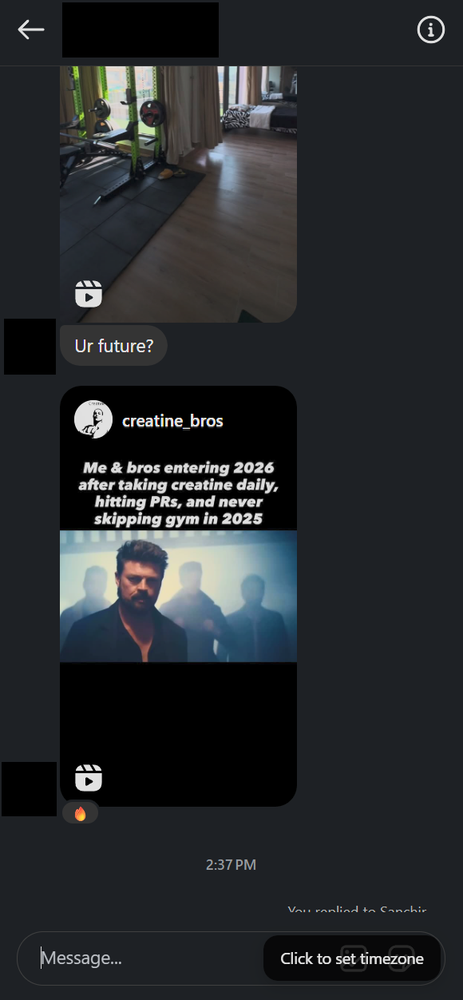
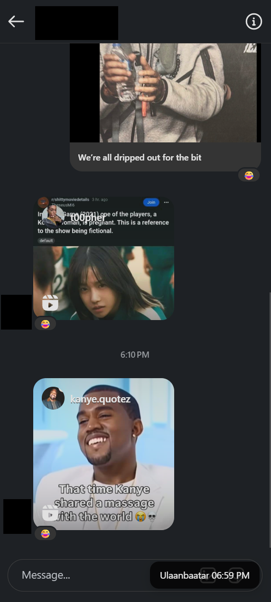

# Chatclock

Chrome Extension to show a chat partner's time zone for for all the folk chatting with people in other timezones. Currently all data is stored locally in Chrome.

## Supported Websites

- https://instagram.com
- https://discord.com

## Roadmap:

- add a bunch of different platforms
- add account support and a paid tier (really cheap, think $0.99) for syncing it across devices
- add a version for non-chromium browsers

## Examples

